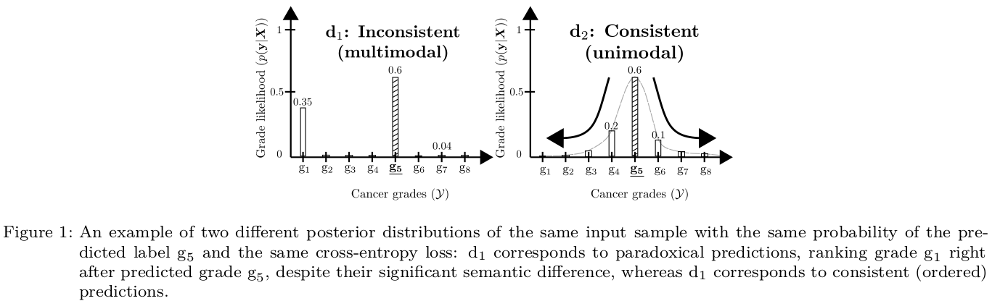
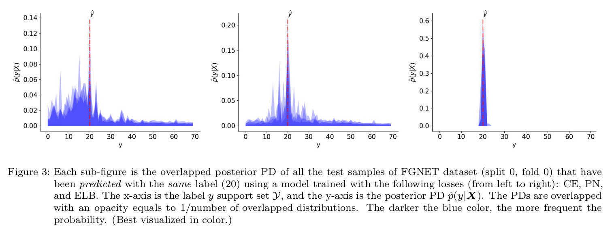

**Please report any issue through the issue tool of Github and not through email.**

### Pytorch code for: `Deep Ordinal Classification with Inequality Constraints`

* **arXiv**: [https://arxiv.org/abs/1911.10720](https://arxiv.org/abs/1911.10720)

* **If you use this code, please cite our work**:
```
@article{belharbi2019unimoconstraints,
  title={Deep Ordinal Classification with Inequality Constraints},
  author={Belharbi, S. and Ben Ayed, I. and McCaffrey, L. and Granger, E.},
  journal={coRR},
  volume={abs/1911.10720},
  year={2019}
}
```

### Content:
* [Demo](#prediction-test-samples-more-results-with-high-resolution-are-in-demom)
* [Method overview](#methodOverview)
* [Requirements](#requirements)
* [How to run the code](#runCode)
* [Reproducibility](#reproducibility)
* [MultiGPU support and reproducibility](#multigpuSupport)
* [Synchronized-Batch-Norm support (MultiGPUs)](#synchBNSupportMultigpu)


# <a name="methodOverview"></a> Method overview:
## Posterior probability consistency in ordinal classification:


# Prediction over FGNET dataset with 70 classes (test samples. More results are in [./demo.md](./demo.md)):



## Download datasets:
See [./cmds](./cmds) on how to download the datasets. You find the splits in [./folds](./folds). Untar first.
The code that generated the splits is [./create_folds.py](./create_folds.py).


# <a name="requirements"></a> Requirements:
We use [Pytorch 1.2.0](https://pytorch.org/) and [Python 3.7.0](https://www.python.org). For installation, see [
./dependencies](./dependencies) for a way on how to install the requirements within a virtual environment.


# <a name="runCode"></a> How to run the code:
```bash
python main.py --cudaid your_cuda_id --yaml basename_your_yaml_file
```
You can override the values of the yaml file using command line:
```bash
python main.py --cudaid 1 --yaml bach-part-a-2018.yaml --bsize 8 --lr 0.001 --wdecay 1e-05 --momentum 0.9 --epoch 4 --stepsize 100 --modelname resnet18 --alpha 0.6 --kmax 0.1 --kmin 0.1 --dout 0.0 --modalities 5 --pretrained True  --dataset bach-part-a-2018 --split 0 --fold 0  --loss LossCE
```
See all the keys that you can override using the command line in  [tools.get_yaml_args()](./tools.py). You can generate the yaml files using [./yaml-gen.py](yaml-gen.py)

## General notes:
* All the experiments, splits generation were achieved using seed 0. See [./create_folds.py](./create_folds.py)
* All the results in the paper were obtained using one GPU with 16GB (not really used) of memory and less than 10GB of RAM.
* Please report any issue with reproducibility.

## Paths:
You need to to set the paths to the data on your own. An error will be raised when the host is not recognized.

# <a name="reproducibility"></a> Reproducibility
## Reproducibility (Single GPU: 100% reproducible):

We took a particular care to the reproducibility of the code.
* The code is reproducible under [Pytorch reproducibility terms](https://pytorch.org/docs/stable/notes/randomness.html).
> Completely reproducible results are not guaranteed across PyTorch releases, individual commits or different platforms.
 Furthermore, results need not be reproducible between CPU and GPU executions, even when using identical seeds.
* The code is guaranteed to be reproducible over the same device INDEPENDENTLY OF THE NUMBER OF WORKERS (>= 0). You
have to use a seed in order to obtain the same results over two identical runs. See [./reproducibility.py](./reproducibility.py)
* Samples can be preloaded in memory to avoid disc access. See [./loader.PhotoDataset()](./loader.py). DEFAULT SEED
IS 0 which we used in all our experiments.
* Samples can be preloaded AND preprocessed AND saved in memory (for inference, i.e., test). However, for large
dataset, and when the pre-processing aims at increasing the size of the data (for instance, upsampling), this is to
be avoided. See [./loader.PhotoDataset()](./loader.py)
* We decorated *sensitive* operations that use random generators by a fixed seed. This allowed more flexibility in
terms of reproducibility. For instance, if you decide to switch off pre-processing samples of a dataset (given that
such operation relies heavily on random generators) and do the processing on the fly, such a decorator seed allows the
state of the random generators in the following code to be independent of the results of this switch. This is a
work-around. In the future, we consider more clean, and easy way to make the operations that depend on random
generator independent of each other.


# <a name="multigpuSupport"></a> MultiGPU support and reproducibility (100% reproducibility not guaranteed. Sometimes the results are different, but most of the time the results are constant):
* The code supports MultiGPUs.
* Despite our effort to make the code reproducible in the case of multigpu, we achieve reproducibility but,
sometimes it breaks. See [this](https://discuss.pytorch.org/t/reproducibility-over-multigpus-is-impossible-until-randomness-of-threads-is-controled-and-yet/47079?u=sbelharbi).


# <a name="synchBNSupportMultigpu"></a> Synchronized-Batch-Norm support (MultiGPUs):
The code supports synchronized BN. By default, SyncBN is allowed as long as multigpu mode is on. You can prevent
using SynchBN, and get back to the standard Pytroch non-synchronized BN, using bash command, before running the code:
```bash
# $ export ACTIVATE_SYNC_BN="True"   ----> Activate the SynchBN
# $ export ACTIVATE_SYNC_BN="False"   ----> Deactivate the SynchBN
```
All the credits of the SynchBN go to Tamaki Kojima(tamakoji@gmail.com) (https://github.com/tamakoji/pytorch-syncbn).
