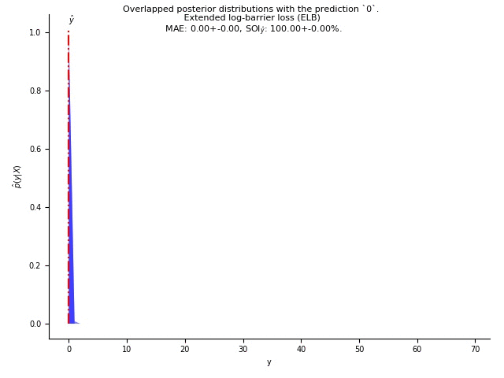
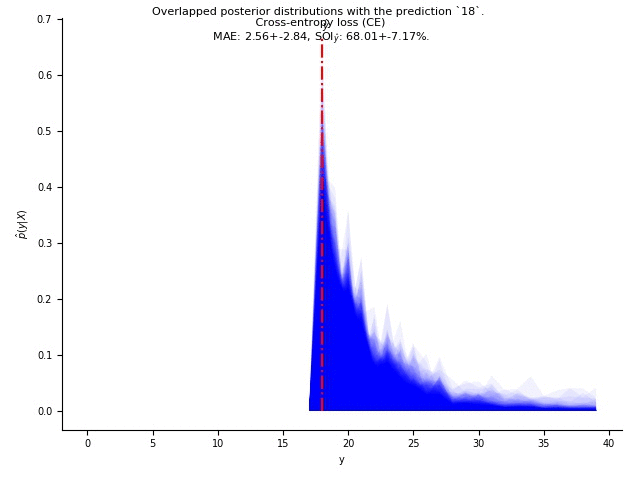
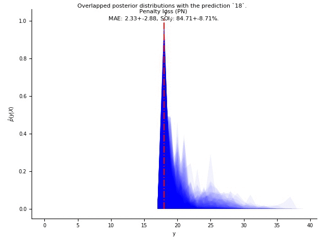
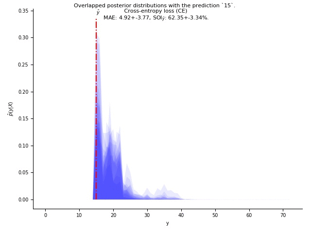
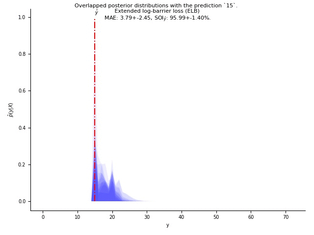

## Posterior distributions of different methods on different datasets. See the caption for more details.

# FGNET test samples (70 classes):
## CE:
 
## PN:
 
## ELB:

# AFAD-Lite test samples (22 classes):
## CE:
 
## PN:
 
## ELB:

# AFAD-Full test samples (58 classes):
## CE:
 
## PN:
 
## ELB:

